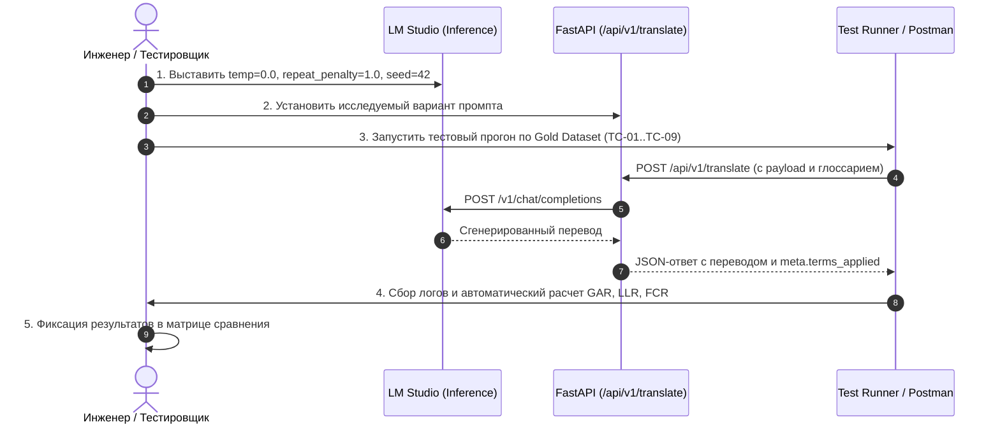

# Регламент A/B-тестирования промптов машинного перевода (RU→EN)

Документ устанавливает официальный регламент, протокол проведения экспериментов, метрики качества и критерии приемки для подбора оптимального системного и пользовательского промптов микросервиса машинного перевода новостей.

---

## 1. Контекст и цели A/B-тестирования

Микросервис осуществляет машинный перевод корпоративных новостей (заголовков, анонсов и полных текстов) с русского языка на английский с соблюдением динамического терминологического глоссария, передаваемого в теле HTTP-запроса (`POST /api/v1/translate`).

### 1.1. Выявленные проблемы базовой версии
1. **Игнорирование терминов при доминировании языкового приора (Semantic Prior):**
   При наличии в словаре точного соответствия для корпоративных систем с нарицательными именами (например, сервис *«Незабудка»* $\to$ `Nezabudka` / `ISURP System`) модель переводит их буквально как цветы (*«forget-me-not»*).
2. **Искажение узкоотраслевых аббревиатур:**
   Аббревиатуры (*«ИСУРП»*, *«СУД»*, *«КИС УАТ»*) при слабой контекстной фиксации транслитерируются некорректно или додумываются моделью.
3. **Падежные формы и морфологический сдвиг:**
   Словарная запись содержит начальную форму (именительный падеж), тогда как в тексте новости термин может стоять в косвенном падеже (*«в Незабудке»*, *«пользователи ИСУРПа»*). Базовый промпт не акцентирует внимание модели на необходимости применять словарный перевод ко всем падежным формам.
4. **Влияние гиперпараметров инференса:**
   Использование штрафа за повторы (`repeat_penalty > 1.0`) в LM Studio заставляет модель заменять повторяющиеся термины глоссария ошибочными синонимами.

### 1.2. Цели регламента
- Обеспечить **100% соблюдение терминологического словаря** для всех обязательных терминов (`GAR = 100%`).
- Полностью исключить буквальный перевод корпоративных имен собственных и сервисов (`LLR = 0%`).
- Зафиксировать воспроизводимый протокол экспериментов для локального стенда (LM Studio) и контура компании (LiteLLM).

---

## 2. Контролируемые параметры инференса (LM Studio & LiteLLM)

При проведении тестирования все параметры инференса должны быть жестко зафиксированы для исключения стохастичности:

| Параметр | Значение | Обоснование |
| :--- | :--- | :--- |
| **`temperature`** | **`0.0`** | Жадное декодирование (Greedy Search). Исключает случайный выбор альтернативных токенов и галлюцинации. |
| **`repeat_penalty`** | **`1.0`** (Выкл) | **Критично.** Штраф за повторы (> 1.0) заставляет модель избегать повторения правильного термина из глоссария между заголовком и текстом. |
| **`seed`** | **`42`** | Фиксация зерна псевдослучайных чисел для 100% воспроизводимости генерации между прогонами. |
| **`top_p`** / **`min_p`** | `1.0` / `0.05` | При температуре 0.0 не влияют; при ненулевой температуре `min_p: 0.05` срезает хвост мусорных токенов. |
| **`max_tokens`** | `1024` | Достаточный лимит для перевода развернутого `detail_text` новости. |
| **`n_ctx` (Context)** | `>= 4096` | Гарантия отсутствия усечения контекста при передаче объемного глоссария. |
| **`chat_template`** | **Native** (ChatML / Mistral) | Шаблон разметки должен строго соответствовать весам загруженной модели. |

---

## 3. Метрики качества оценки промптов

Каждый кандидат промпта оценивается по 4 объективным метрикам:

### 3.1. GAR (Glossary Adherence Rate) — Коэффициент соблюдения глоссария
Процент обязательных терминов из глоссария, корректно и без искажений переведенных в выходном тексте:
$$\text{GAR} = \frac{N_{\text{correct\_matched\_terms}}}{N_{\text{total\_mandatory\_terms\_in\_text}}} \times 100\%$$
- **Целевое значение:** **`100%`** (критическое требование приемки).

### 3.2. LLR (Literal Leakage Rate) — Частота ложного буквального перевода
Процент случаев, когда термин с собственным значением (например, система «Незабудка») был переведен моделью дословно в общеязыковом значении (*«forget-me-not»*):
$$\text{LLR} = \frac{N_{\text{literal\_mistranslations}}}{N_{\text{proper\_names\_in\_text}}} \times 100\%$$
- **Целевое значение:** **`0.0%`**.

### 3.3. FCR (Format & Style Compliance Rate) — Соблюдение структуры и формата
Проверка отсутствия артефактов инференса:
- Отсутствие вводных мета-фраз модели (*«Here is the English translation:»*, *«Sure, below is...»*).
- Отсутствие непереведенных русских фрагментов.
- Сохранение исходного форматирования, абзацев, чисел, аббревиатур и дат.
- **Целевое значение:** **`100%`**.

### 3.4. Latency & Token Economy — Скорость и расход контекста
- Среднее время обработки одного запроса перевода новости (мс).
- Количество входных токенов промпта (чем лаконичнее промпт при сохранении качества, тем выше пропускная способность).

---

## 4. Золотой тестовый датасет (Gold Test Dataset)

Для валидации промптов используется эталонная выборка новостей, покрывающая все проблемные краевые случаи:

| ID кейса | Название сценария | Исходный русский фрагмент | Термин глоссария | Ожидаемый корректный перевод | Недопустимый перевод (Fail) |
| :--- | :--- | :--- | :--- | :--- | :--- |
| **TC-01** | Омоним «Незабудка» (Именительный падеж) | «Развертывание системы ИСУРП (Незабудка) в филиальной сети.» | `"Незабудка": "Nezabudka"` | `"... ISURP (Nezabudka) system ..."` | `"... forget-me-not ..."` |
| **TC-02** | Омоним «Незабудка» (Предложный падеж в кавычках) | «Специалисты завершили работы в сервисе «Незабудка».» | `"Незабудка": "Nezabudka Service"` | `"... in the Nezabudka Service."` | `"... in the forget-me-not ..."` |
| **TC-03** | Склонение «Незабудки» (Родительный падеж) | «Для масштабирования Незабудки выделены серверные мощности.» | `"Незабудка": "Nezabudka platform"` | `"... scaling of the Nezabudka platform ..."` | `"... scaling of forget-me-not ..."` |
| **TC-04** | Аббревиатура «ИСУРП» | «Внедрение системы ИСУРП переходит в финальную фазу.» | `"ИСУРП": "ISURP"` | `"... ISURP system ..."` | Произвольная выдуманная аббревиатура |
| **TC-05** | Склоняемая аббревиатура «ИСУРПа» | «Пользователи ИСУРПа получили расширенные права доступа.» | `"ИСУРП": "ISURP"` | `"... ISURP users received ..."` | `"... ISURPa ..."` |
| **TC-06** | Связка аббревиатур IT-инфраструктуры | «В рамках обеспечения работы сервисов КИС УАТ и ЕППО выделены ресурсы для СУД.» | `"СУД": "Data Management Service (DMS)"`, `"КИС УАТ": "KIS UAT System"`, `"ЕППО": "Unified Procurement Platform"` | Точное использование всех трех утвержденных английских аббревиатур | Перевод СУД как `Court` (судебный орган) |
| **TC-07** | Многословные термины (5+ слов) | «Модернизирована автоматизированная система управления технологическими процессами.» | `"автоматизированная система управления технологическими процессами": "automated process control system"` | `"automated process control system"` | Разрозненный перевод отдельных слов |
| **TC-08** | Технические и числовые сущности | «Linux-сервер с 3 ускорителями NVIDIA A100 и 324 ГБ ОЗУ.» | — | `"Linux server with three NVIDIA A100 accelerators and 324 GB RAM."` | Искажение чисел, единиц измерения, пропуск моделей GPU |
| **TC-09** | Baseline без глоссария | «Ремонт магистрального нефтепровода завершен.» | `{}` (пустой глоссарий) | Качественный литературный перевод без галлюцинаций | Появление предупреждений об отсутствии словаря |

---

## 5. Матрица кандидатов промптов для тестирования

### Вариант A (Текущий Baseline)
- **Системный промпт:** Однострочная инструкция без упоминания глоссария:
  > *Translate the following Russian text into English. Preserve the complete meaning, numbers, dates... Return only the English translation without explanations.*
- **Пользовательский промпт:** Простой список `- ru => en`.
- **Слабые стороны:** Модель воспринимает глоссарий как мягкую подсказку; имена собственные переводятся буквально.

---

### Вариант B (Negative Constraints & Hard Enforcement)
- **Концепция:** Добавление явных категорических запретов и приоритета словаря над языковыми ассоциациями:
  > *CRITICAL RULE: Corporate terms and software names (e.g., "Незабудка") must NEVER be translated literally as general vocabulary (e.g., never as "forget-me-not"). Always enforce the provided corporate glossary regardless of context.*

---

### Вариант C (Структурированный MD + XML)
- **Концепция:** Изоляция блоков через XML-теги (`<role>`, `<critical_rules>`, `<glossary>`, `<source_text>`, `<translation>`).
- **Преимущество:** Современные трансформеры (Qwen, Mistral, Llama, MiLMMT) обучались на тегированных датасетах. Теги резко снижают вероятность слияния инструкций и исходного текста новости.

---

### Вариант D (Morphology & Case Invariance Rule)
- **Концепция:** Явная директива на инвариантность к падежам русского языка:
  > *Grammatical Case Rule: The provided glossary maps base terms to English equivalents. You MUST apply these exact translations even if the Russian term appears in an inflected, declined, or plural form (e.g. "в Незабудке", "Незабудкой", "ИСУРПа").*

---

### Вариант E (Golden Master — Комбинированный стандарт)
- Объединяет преимущества B, C и D в единую структуру MD + XML:
  1. Ролевая модель технического переводчика.
  2. Блок `<critical_rules>` с отрицательными ограничениями.
  3. Правило грамматических падежей и склонений.
  4. Четкое тегирование входных данных.
  5. Полная совместимость с LiteLLM в корпоративном контуре.

---

## 6. Пошаговый протокол проведения эксперимента (Runbook)

### Порядок действий:
1. **Шаг 1. Подготовка LM Studio:**
   - Загрузить модель в память.
   - В панели настроек инференса LM Studio выставить: `temperature = 0.0`, `repeat_penalty = 1.0`, `seed = 42`.
2. **Шаг 2. Запуск сервиса:**
   - Запустить FastAPI сервис (`uvicorn src.backend.main:app --port 8000`).
3. **Шаг 3. Итеративный прогон вариантов (A $\to$ B $\to$ C $\to$ D $\to$ E):**
   - Для каждого варианта обновить файл системного/пользовательского промпта.
   - Прогнать запросы Gold Dataset (через Postman Runner или тестовый скрипт).
   - Сохранить сырые ответы модели в артефакт тестирования.
4. **Шаг 4. Расчет метрик:**
   - Вычислить `GAR`, `LLR` и `FCR` для каждого кейса.
5. **Шаг 5. Принятие решения:**
   - Кандидат признается победителем (Golden Prompt) только при соблюдении критериев приемки.

---

## 7. Критерии приемки (Release Gate)

Промпт утверждается в качестве релизного (`Golden Standard`) только при одновременном выполнении условий:
1. **`GAR` (Glossary Adherence Rate) = `100.0%`** на всех кейсах золотого датасета.
2. **`LLR` (Literal Leakage Rate) = `0.0%`** (ни одного случая буквального перевода сущностей).
3. **`FCR` (Format Compliance) = `100.0%`** (полное отсутствие мета-текста модели).
4. **Отсутствие регрессий:** все unit-тесты проекта (`pytest tests/`) проходят успешно.
5. **Совместимость с LiteLLM:** корректный сквозной проброс через прокси-сервер компании.
